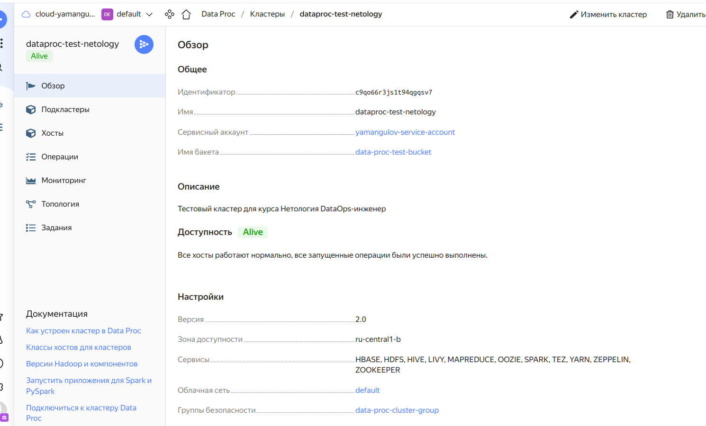
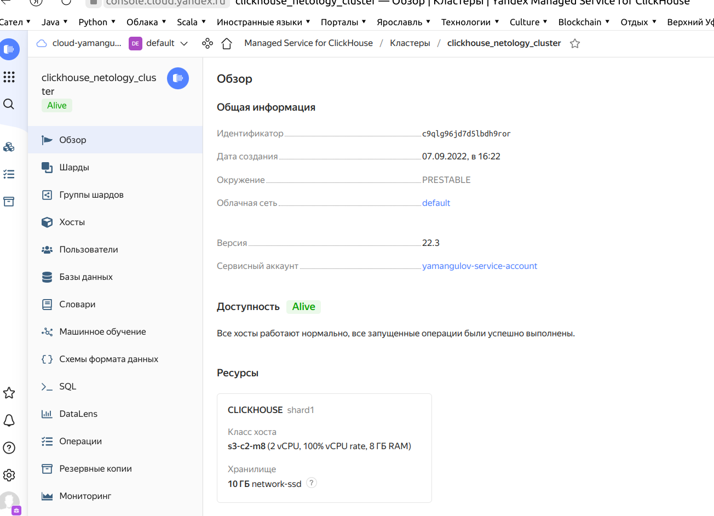
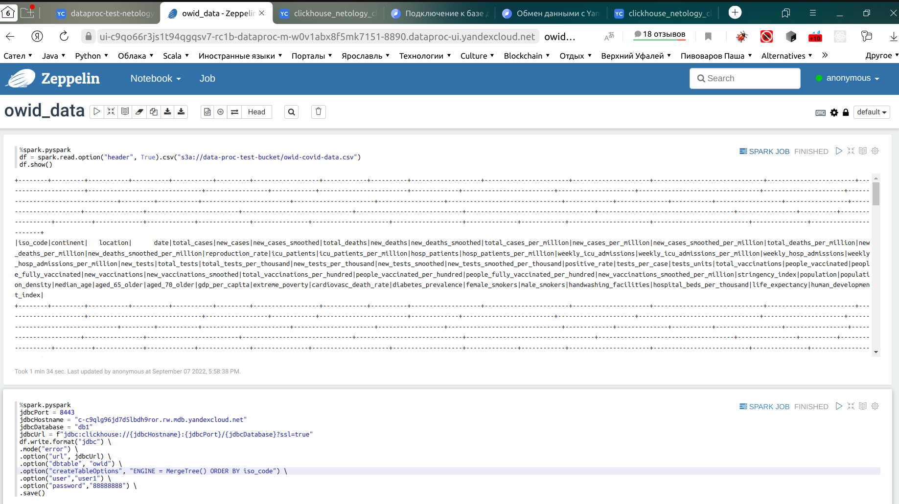
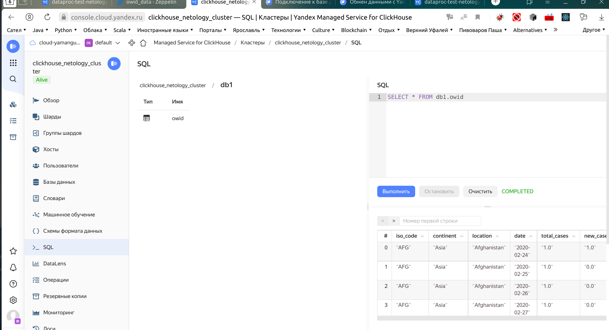
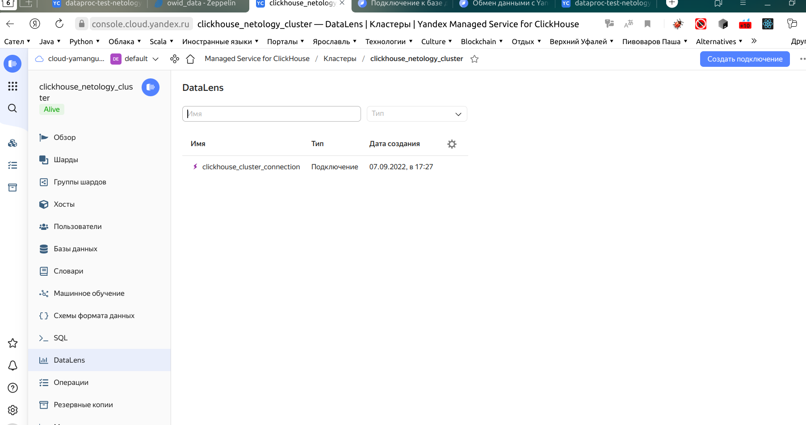
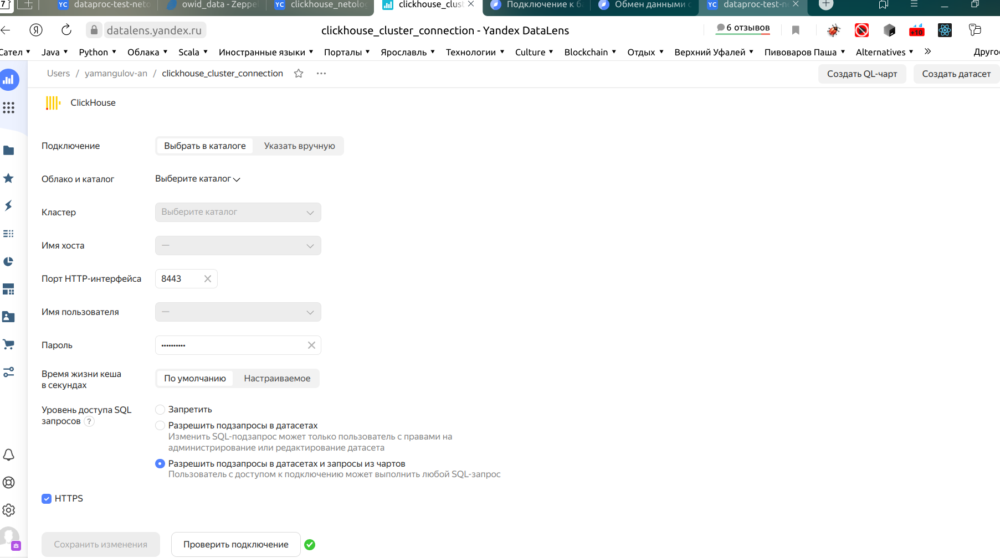
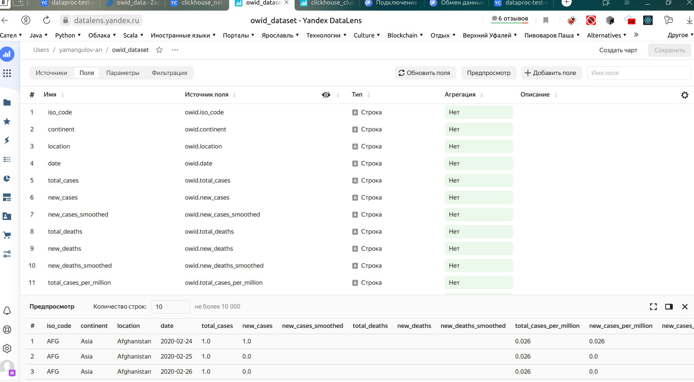
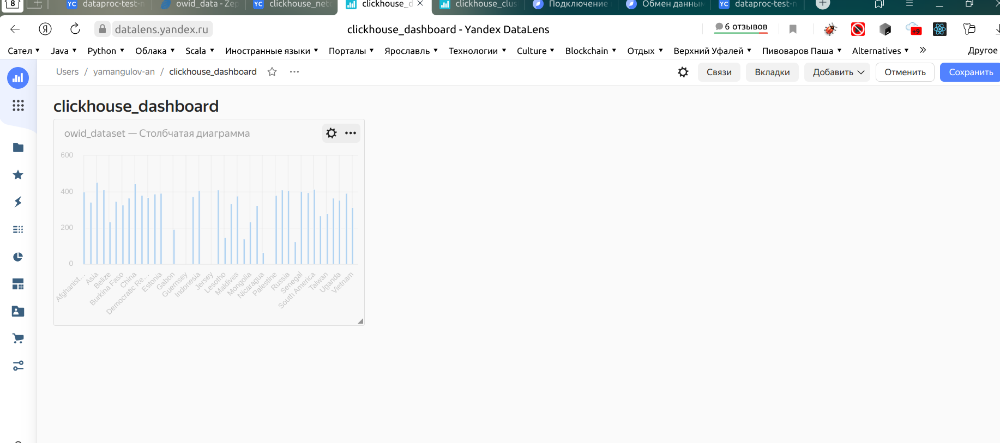
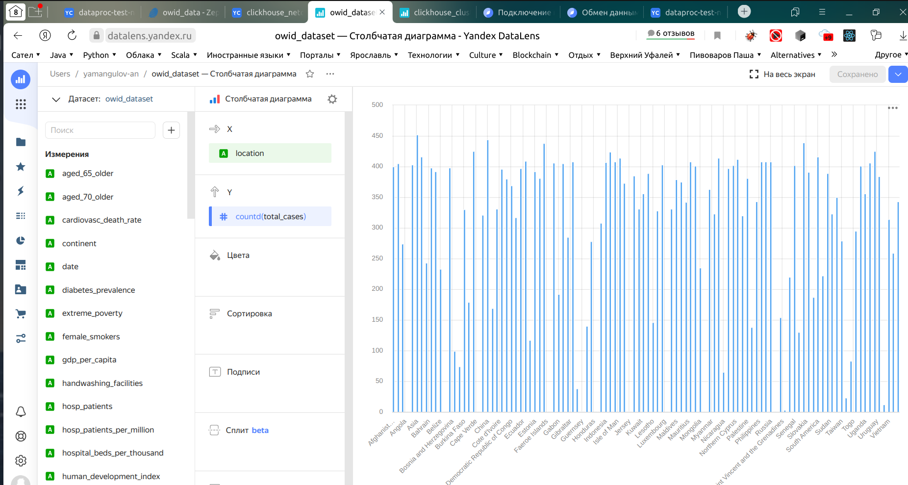

- Подготовить источники данных вне облака

В качестве источников данных будем использовать файлы в формате csv, взятые, например, из других модулей курса:

[ovidp-covid-data.csv](owid-covid-data.csv)

- Развернуть аналитическую СУБД в облаке

Для упрощенного варианта пайплайна выберем аналитическую БД Clickhouse из того соображения, что с ней я уже работал ранее на курсе. Соответственно, нам понадобятся:

1. Средство ETL обработки - будем использовать Zeppelin для загрузки csv файла через Data Proc Apache Spark в Managed Service for Clickhouse
2. Для хранения и обработки удобным будет Data Proc: Apache Spark, а для дашбордов - Managed Service for Clickhouse
3. Для визуализации воспользуемся дашбордами DataLens

- Организовать загрузку данных из источников в аналитическую СУБД

1. Установлен кластер Data Proc

2. Установлен и настроен кластер Managed Service for Clickhouse

3. Файл [owid-covid-data.csv](owid-covid-data.csv) загружен в clickhouse db через Zeppelin (который имеется в составе Data Proc)

Проверил, что данные появились в clickhouse кластере в db

- Создать витрины
- Создать дашборды
Настроил подключение к DataLens

В DataLens создал все, что позовлял его интерфейс в моем случае

Должен отметить, что добавление чарта на дашборд хотя и прошло успешно, но при сохранении вылетает ошибка с предложением обратиться в техподдержку, пока не стал с этим разбираться, так как это выходит за рамки задачи (какой-то баг в Yandex)