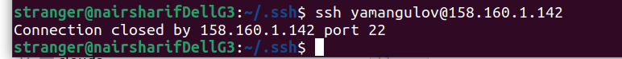

- Создать виртуальную машину с 20% vCPU

Выполнено:

- Поработать со снимками

На всякий случай установим пароль для пользователя, чтобы был доступ из серийной консоли, когда доступ по ssh невозможнен

Поскольку мы будем повреждать файловую систему, то лучше сразу работать из серийной консоли

Замораживаем файловую систему

Делаем снимок диска

Размораживаем файловую систему

Повреждаем файловую систему

и видим, что уже не можем зайти на vm по ssh, хотя доступ через серийную консоль сохранена

Восстанавливаем диск из снимка, создав новую vm и подключив диск из снимка к ней

- Создать группу виртуальных машин

Выполнено:

Машины создались

