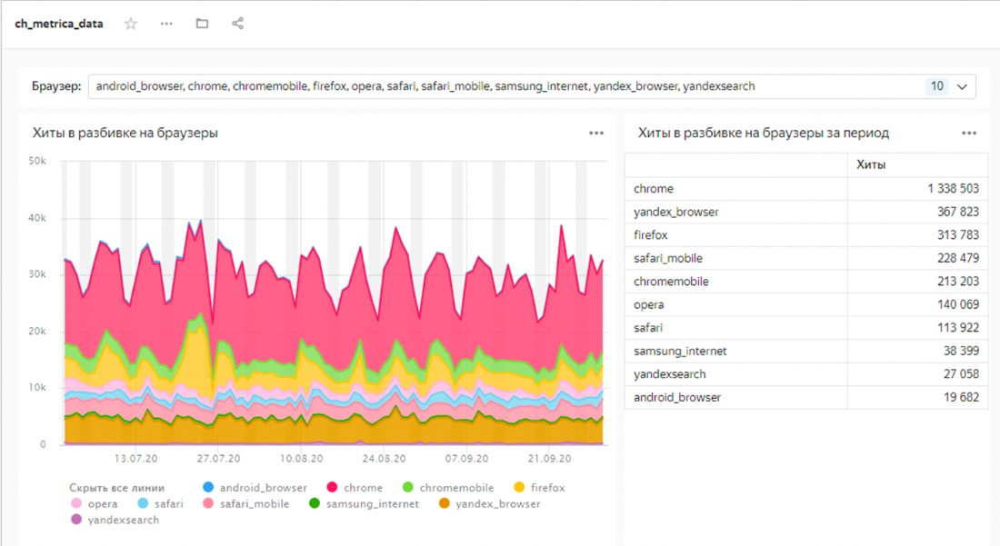

### Домашнее задание по теме "Хранение и анализ данных в Yandex.Cloud"

- Создайте кластер managed clickhouse - тип b2.medium, размех хранилища 30 Гб ssd, хост с публичным доступом.
- Включите дополнительно доступ к datalens и доступ к из консоли управления
- Загрузите в Clickhouse данные датасетов хитов и визитов тестовых данных яндекс метрики
- Подключите Datalens к кластеру и подключите таблицы как датасеты
Сделайте дашборд который покажет как хиты распределяются по браузерам на графике и суммарно. Как на картинке ниже

**В помощь:**

Работа с данными метрики и clickhouse [https://cloud.yandex.ru/docs/tutorials/datalens/data-from-metrica-yc-visualization](https://cloud.yandex.ru/docs/tutorials/datalens/data-from-metrica-yc-visualization)