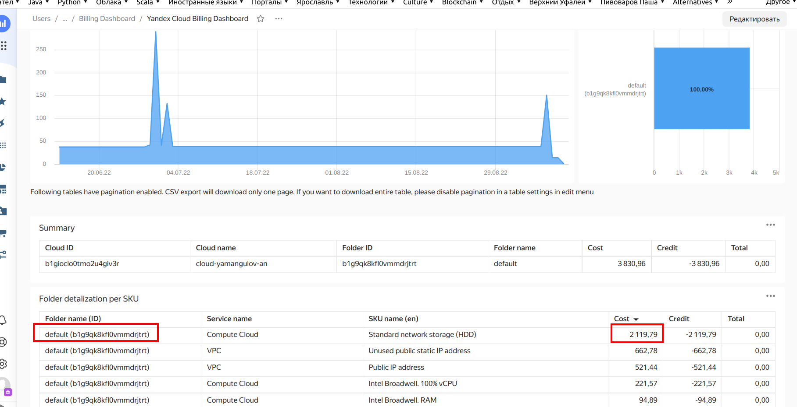

Подключите ваш биллинг аккаунт к datalens и посмотрите что могут дашборды

- Подключайте согласно документации
- Найдите в нем folder в котором вы произвели наибольшие траты. Так как у вас используется грант используйте поле Raw consumption

Выполнено:

