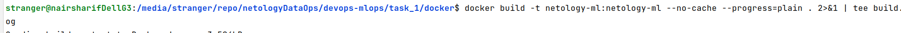
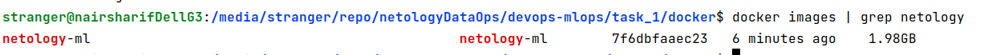

По составленному [Dockerfile](docker/Dockerfile) выполняем сборку командой

чтобы добавить лог в файл [build.log](docker/build.log) и также видеть в терминале, когда закончится сборка, так как она довольно длительная

Затем проверяем наличие собранного образа

