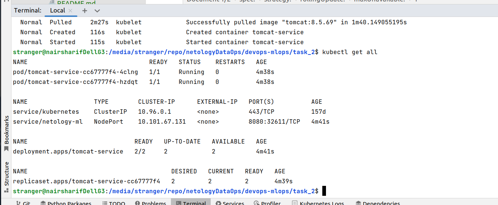

#### Ответы на вопросы

- Что такое k8s?

k8s - сокращенная обозначение для kubernetes - это система оркестрации контейнеров

- В чём преимущество контейнеризации над виртуализацией?

виртуализация неэкономно использует ресурсы, создавая отдельный слой ОС установленной поверх базовой ОС, кроме того, не всегда эмуляция аппаратных ресурсов в этом случае работает корректно и устойчиво

контейнеризация поверх базовой ОС создает изолированную среду исполнения для запуска контейнеров, что требует существенно меньше ресурсов, работает устойчивее и легче управляется - легче изолируются и ограничиваются ресурсы на один контейнер, достигается практически 100% переносимость контейнеров, при переносимости обеспечивается полная идентичность исполняющей среды приложения в разных конфигурациях среды (разработка, тестирование, деплоймент в продуктиве), облегчается создание микросервисной архитектуры и, по этой причине, облегчается процесс масштабирования приложений, в том числе автоматического

- В чём состоит принцип самоконтроля k8s?

k8s умеет самостоятельно внутренними средствами отслеживать состояние запущенных в нодах приложений, откатывать, запускать, перезапускать, обновлять и заменять контейнеры в подах по настроенным правилам, например, в случае отказа, апгрейда и т. п.

- Как вы думаете, зачем Вам понимать принципы деплоя в k8s?

k8s - наиболее распространенная в настоящее время система оркестрации, для которой проработана интеграция с множеством стеков технологий, она используется повсеместно, поэтому знание принципов помогает как самостоятельно выполнять деплой приложений, так и понимать причины возникновения возможных ошибок в развертывании

- Какое из средств управления секретами наиболее распространено в использовании совместно с k8s?

обычно используется стандартный Hashicorp Vault, который поддерживается в k8s по умолчанию

- Какие типы нод есть в k8s, каковы их базовые функции?

мастер ноды используются для управления кластером, обычно включают в себя api server, scheduler, controller manager, etcd, общепринято не загружать мастер ноды никакими другими функциями и исполнением пользовательских приложений (это может сделать мастер ноду недоступной при аварии или чрезмерном использовании ресурсов на пользовательских приложениях и кластер также перейдет в аварийное состояние)

worker ноды - предназначены непосредственно для развертывания приложений в кластере, обычно содержат kubelet, kube-proxy и контейнерную среду исполнения, настроенную на взаимодействие с docker или другим средством контейнеризации, доступным для работы совместно с k8s

манифест к задаче находится в файле [tomcat-deployment.yml](tomcat-deployment.yml)

манифест проверен на работоспособность:

