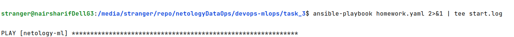

Задание выполнено, при выполнении выявлены и успешно отлажены следующие особенности, связанные с тем, что ansible хост у меня с ОС ubuntu, и для отладки я использовал также два хоста в Яндекс облаке с установленными ОС ubuntu:
1. требуется установка пакета sshpass для работы с неинтерактивными сеансами из ubuntu, а также в файле [ansible.cfg](ansible.cfg) потребовалось добавить строку `host_key_checking=False`
2. пакет net_tools  в ubuntu называется net-tools
3. в [inventory](inventory) нужно вместо ansible-password использовать опцию ansible_ssh_pass
После чего выполняем playbook с сохранением лога  в файле [start.log](start.log)

Все успешно выполнилось, изменения в хостах в Яндекс облаке также наблюдаются при проверке в их консолях.