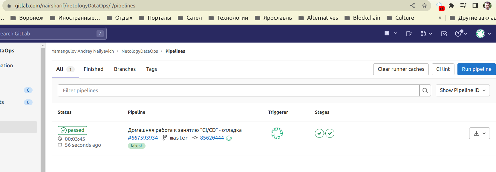
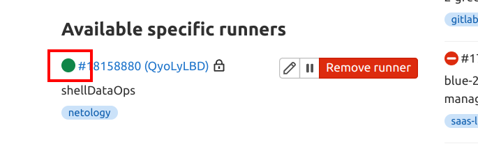

gitlab ci/cd выполняется в gitlab, поэтому копирую проект в gitlab, расположен он здесь:

https://gitlab.com/nairsharif/netologyDataOps/-/tree/master/

Файл .gitlab-ci.yml создаем только в каталоге [task_4](.gitlab-ci.yml), чтобы удобно работать с ним.

gitlab-runner у меня уже был ранее установлен, осталось зарегистрировать runner:

После push видим успешное выполнение задания в gitlab:

Примечания о проблемах, выявленных при отладке:
1) необходимо дождаться подтверждения не только регистрации runner, но и чтобы он в gitlab показал, что был хотя бы первый контакт (зеленый значок, а не серый треугольник)

2) на скрине показан вариант регистрации без sudo на хосте с ubuntu - при этом runner зарегистрировался у меня, но так и не установил контакт, серый треугольник висел бесконечно, пока я не перерегистровался под sudo
3) push с изменениями в проекте нужно выполнять только после успешного первого контакта runner с gitlab, иначе он не понимает, что изменения были и не запустит пайплайн
4) по неизвестной мне причине пайплайн так и несоздался, пока я не переименовал файл .gitlab-ci.yaml в .gitlab-ci.yml (сменил расширение файла) - возможно, одноразовый глюк в gitlab, а возможно, постоянная проблема
5) если файл пайплайна лежит не в корне проекта, не забываем перенастроить в ci/cd путь к нему в секции settings -> general pipelines

В целом задание выполнено успешно.

