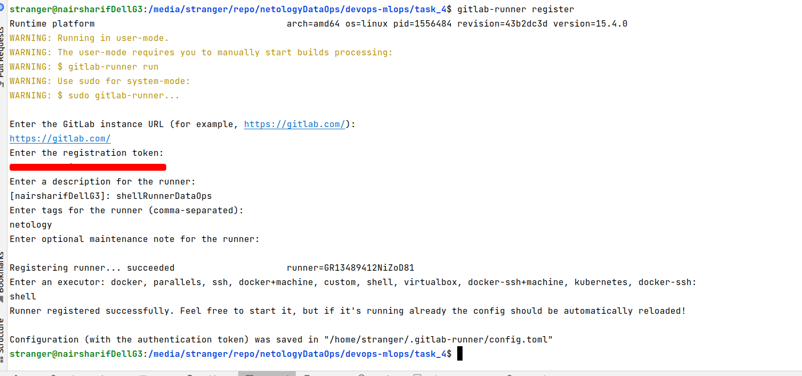

gitlab ci/cd выполняется в gitlab, поэтому копирую проект в gitlab, расположен он здесь:

https://gitlab.com/nairsharif/netologyDataOps/-/tree/master/

Файл .gitlab-ci.yaml создаем только в каталоге [task_4](.gitlab-ci.yml), чтобы удобно работать с ним.

gitlab-runner у меня уже был ранее установлен, осталось зарегистрировать runner:

