Прежде всего, для выполнения задания нельзя использовать предложенный вариант docker-compose.yml из репозитория https://github.com/stefanprodan/dockprom, потому что некоторые ссылки либо устарели, либо требуют авторизации gcloud, которую из РФ теперь трудно будет настроить. 

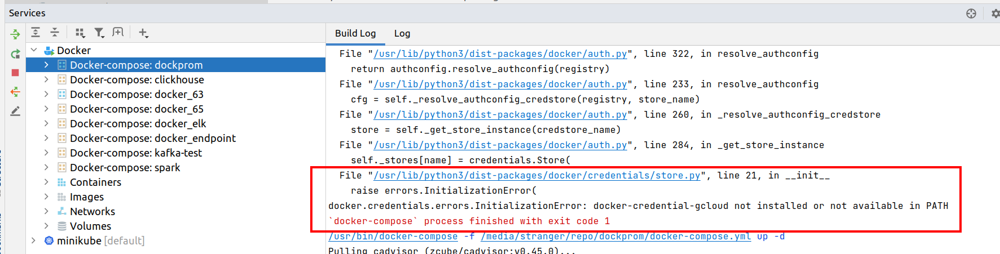

А именно вот этот образ не получить из указанного источника

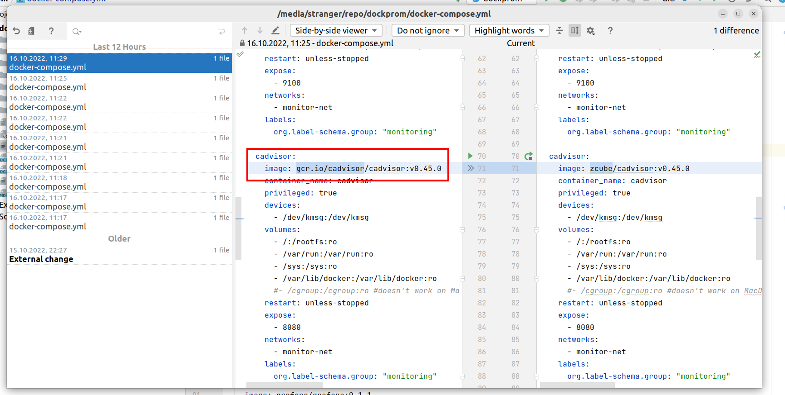

Поэтому самый легкий путь - немного модифицировать файл, чтобы получить тот же самый образ cadvisor из hub.docker.com. Образец модифицированного файла прилагаю - [docker-compose.yml](docker-compose.yml). Он корректно запускается и поднимает все контейнеры без ошибок.

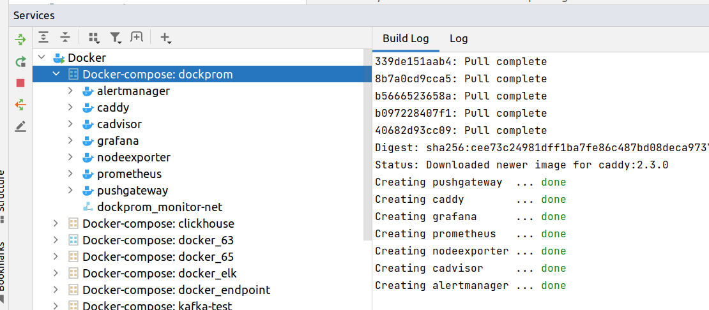

Логинимся в prometheus, просмотрим alerts и rules

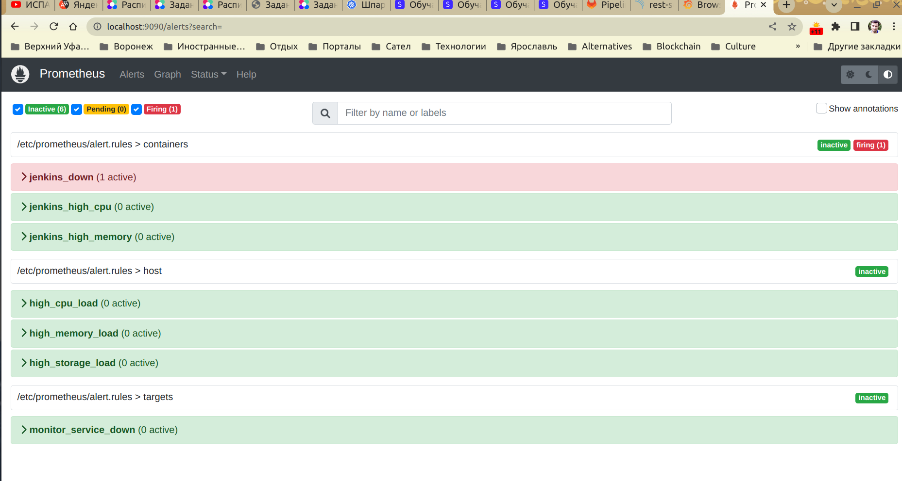

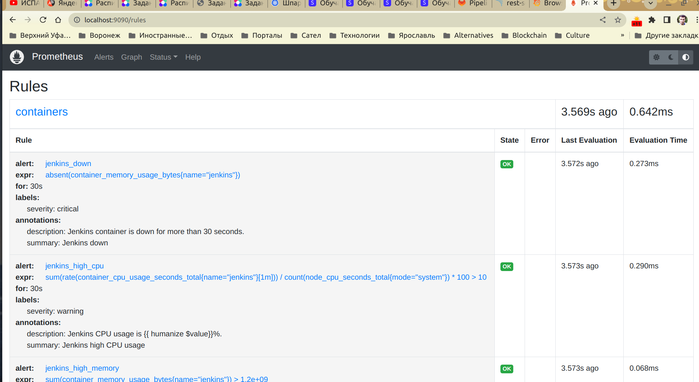

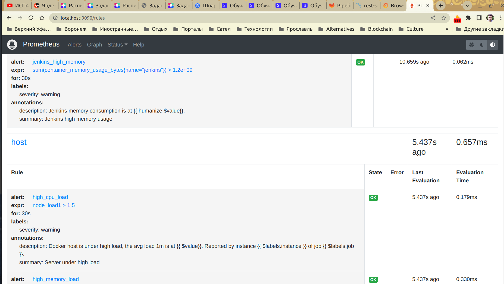

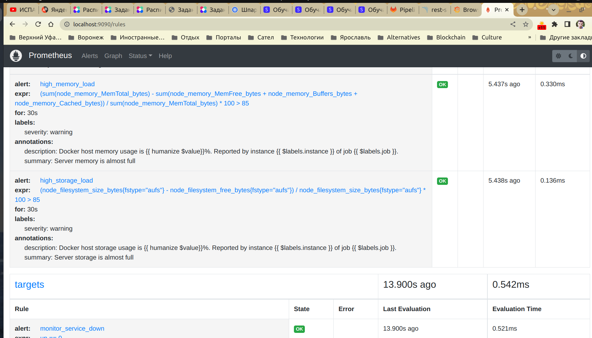

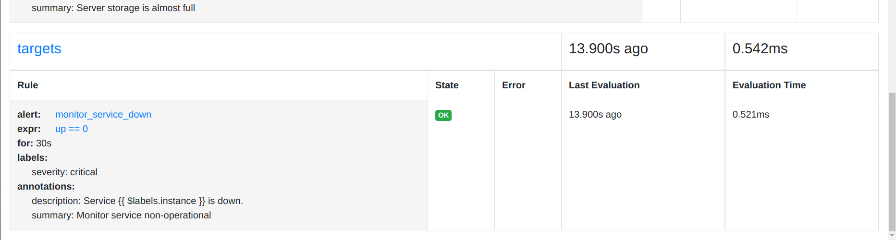

Логинимся в graphana, смотрим, какие есть дашборды

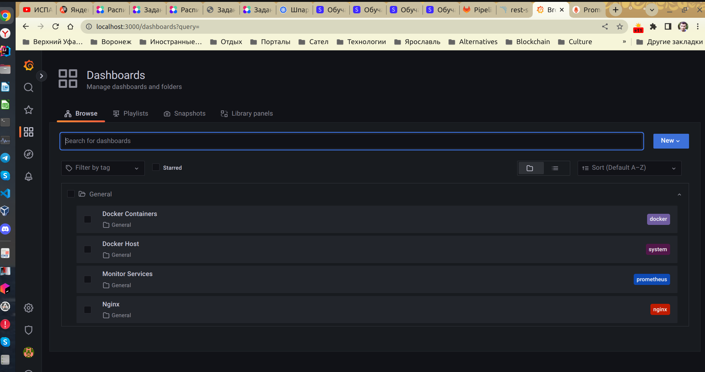

Их четыре. Три из них предназначены для отображения многих различных метрик, получаемых из prometheus для хоста docker в целом, для различных docker контейнеров и для служб, последний дашборд предназначен для отображения метрик nginx, источником также является prometheus (это все видно в json моделях в настройках отдельных дашбордов) - но последний дашборд не активен, потому что у нас нет запущенного nginx, для которого были бы настроены сборы метрик в prometheus - нет данных, поэтому в дашборд ничего не приходит.

Посмотрим на дашборд docker containers grafana

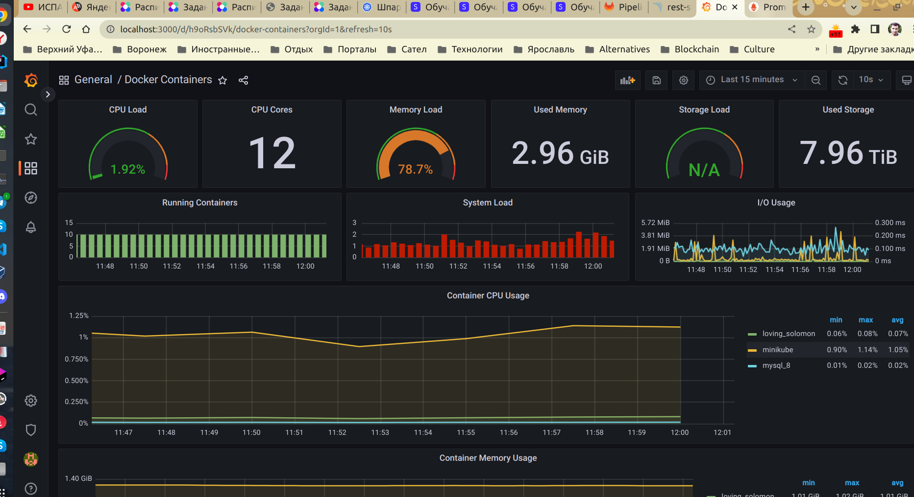

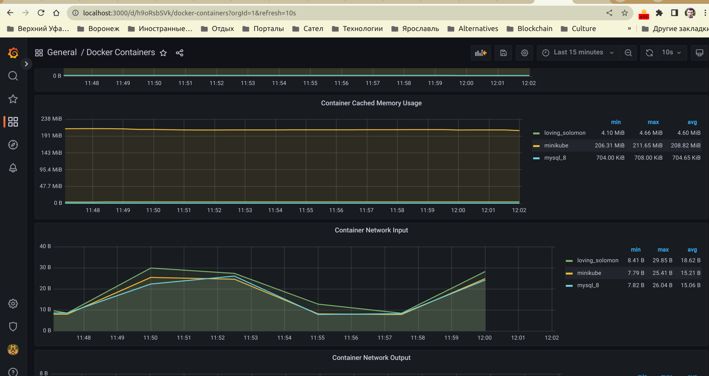

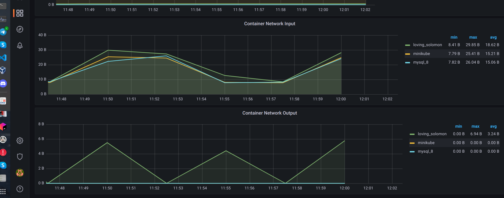

Мы видим метрики, отображающие загрузку памяти, процессора и хранилищ (дисков), а также графики для container cpu usage, conainer memory usage, container cached memory usage, container network input, container network output