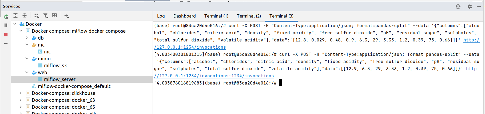

Вытягиваем проект из https://github.com/sachua/mlflow-docker-compose и работаем прямо в нем, целесообразно будет изменить порядок выполнения пунктов задания, чтобы оптимально подготовиться к запуску.

Настраиваем переменные:
export MLFLOW_TRACKING_URI=http://localhost:5000 (в тексте задачи пропущен порт)
export MLFLOW_S3_ENDPOINT_URL=http://minio:9000 (в тексте задачи указан localhost, но это фактическая ошибка, так как при настройке из терминала web - localhost будет указывать на web, а не на minio!!!)
сразу в docker-compose.yml, чтобы они уже были правильными, также можно было бы воспользоваться уже созданным файлом .env и добавить переменные среды через него.

Теперь можно попробовать запустить проект:
(у меня порт 9000 оказался занят, поэтому я перенастроил minio и web на порт 9002)

(mc отмечен желтым, так как он и должен останавливаться после выполнения своей задачи, см. entrypoint)

Проверяем, что web доступен

Выполняем `pip install mlflow[extras]`

Обновляем кэш репозитория командой `apt update` и устанавливаем wget `apt install wget`, затем выкачиваем conda и устанавливаем его:

При исправлении ошибки ModuleNotFoundError не забываем запустить новый отдельный терминал, команда conda activate запустилась у меня только в отдельном терминале, после чего я вернулся в первый терминал и запустил обучение успешно.

(мне также потребовалось добавить путь к conda в PATH и установить git, иначе mlflow выдаст ошибку Bad git executable)

Затем запускаем обучение модели, видим, что оно запустилось, и затем модель готова отвечать на запросы

но при каждом запросе к модели есть warnings, указывающий на функции, которые будут изменены в будущих релизах

Пробуем показать модель, поиграв с параметрами запроса:

Все ок, можем также посмотреть результаты эксперимента в веб mlflow

