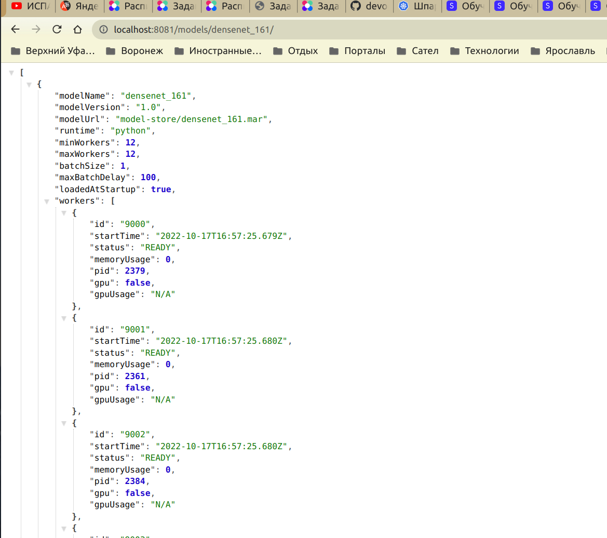

Сделаем удобную заготовку [docker-compose.yml](build/docker-compose.yml), чтобы использовать ее с настройками для production (пригодится в будущем). Контейнер успешно стартует:

Загружаем модель с помощью wget и архивируем ее

Далее, поскольку я выбрал установку torchserver из docker образа, мне недоступна установка дашборда, похоже, что это связано с неудовлетворением зависимостей, которые в сырой установке из образа не получить. Вероятно, при установке через conda дашборд удалось бы установить

Тем не менее, можно проверить работу модели в терминале, либо сделав запросы в браузере

