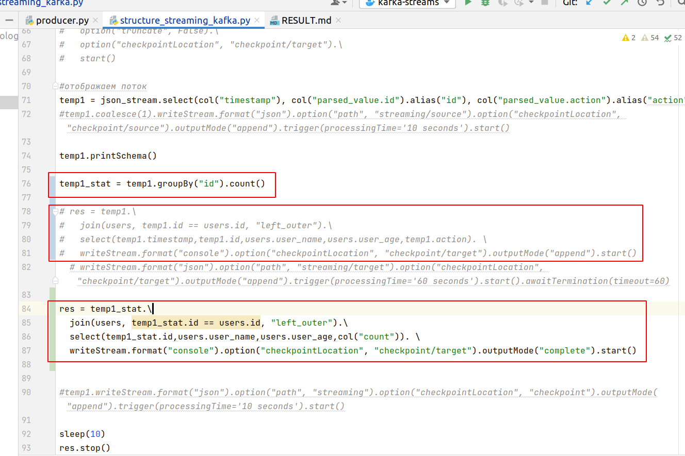
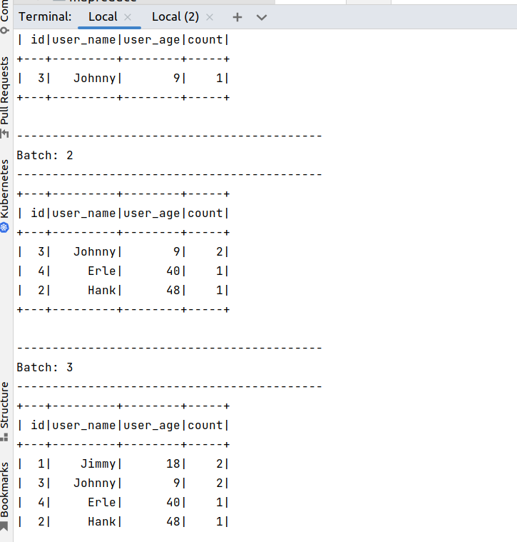

второй вариант доработки по рекомендации преподавателя:

Нужно добавить группировку и удалить селект по полям, которых теперь не будет в итоговой схеме

После чего получаем интересный результат, но нужно иметь ввиду, что следует удалить старый каталог checkpoint, сохранившийся от предыдущих запусков файла со старой версией кода, он не совместим с новым кодом и не даст ему запуститься:

