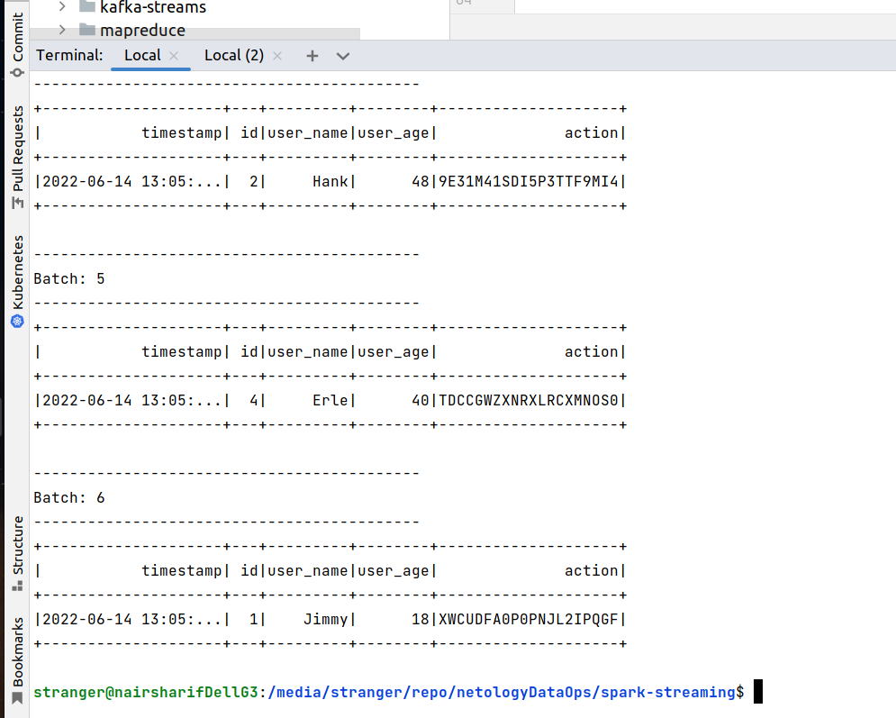

запуск приложения Spark

зависимости докачались, приложение запустилось, начались батчи

результат join

дополнительное задание в коде здесь (комментируем лишний код ниже)

результат после модификации такой

то есть в каждом батче накапливаем и выводим данные по статистике пользователей

после доп. задания я снова раскомментировал исходный код